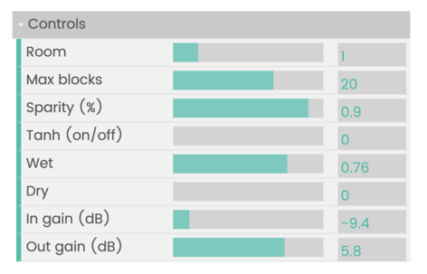

# bela-zlc
Zero-latency convolution on Bela platform

| [Report](docs/report.pdf) | [Video](https://www.youtube.com/watch?v=PuP8an5F2rk) | 

## Overview

Convolution has many applications in audio, such as equalization and artificial reverberation. 
Unfortunately, performing convolution with large filters, as is common in artificial reverberation, can be computationally complex when utilizing the direct-form implementation. Block-based convolution that takes advantage of the FFT, performing filtering in the frequency domain, 
can significantly accelerate this operation, but comes at the cost of higher latency. 
To balance these forces, so-called ‘zero-latency’ convolution
has been proposed, which breaks up the filter so that the early part is implemented with the direct form
and later blocks are implemented with the FFT. 
In this project, the goal is to implement a ‘zero-latency’ convolution on the Bela platform to enable real-time effects utilizing large convolutions. 
A simple realtime convolutional reverb effect is demonstrated, along with a UI that enables users to adjust the quality
of the reverb. 
Future work will incorporate additional optimizations, as well as investigate the applicability of sparsity, in order to enable large kernel convolutions
for the implementation of TCNs in real-time neural audio effects.